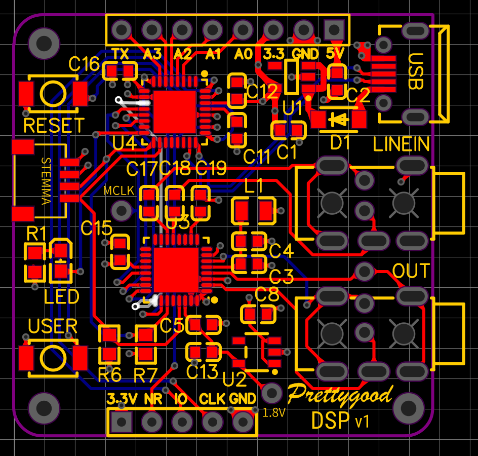
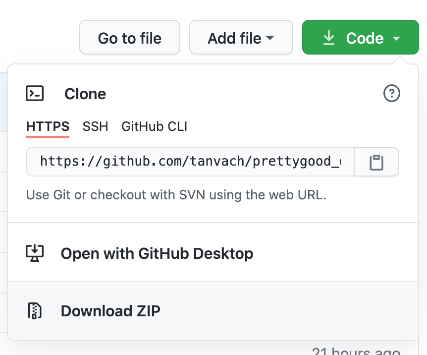

# Prettygood DSP

A self contained, Arduino compatible board for applying audio DSP. The intended purpose is to equalize and apply bass boost to [BMR VR off ear headphones](https://prettygood3d.com/post/999028410814/quest-2-off-ear-bmr-v01), but can be adapted for any other light DSP tasks by SGTL5000 codec.

Supports:
-   7 band prarametric or 5 band graphic EQ.
-   Psycho-acoustic bass boost to over come limited bass response of small headphone drivers.
-   Stereo surround expansion.
-   Automatic volume control.

Please see the SGTL5000 [documentation](https://www.pjrc.com/teensy/SGTL5000.pdf) for all DSP features. Credit to [Paul Stoffregen of PJRC.com](https://github.com/PaulStoffregen/Audio) for creating the Teensy Audio library (we're reusing a SGTL5000 component in the code).

TODO:
-   Make use of the USER button for switching between presets.
-   Refactor code and put configurations in a header file.

# Usage
- Plug in a USB power source (anything from computer, phone, Quest/Quest 2 or USB power bank).
- Plug in 3.5mm stereo jack from audio out to LINEIN.
- Plug your headphones into OUT.

NOTE: the OUT port is designed to drive headphones. It may not work as intended as an input into another audio device.

# Board Design

The board is designed based on [Adafruit SAMD21 QtPy](https://learn.adafruit.com/adafruit-qt-py). The default bootloader is vanilla SAMD21 QtPy and can be download from [Adafruit SAMD UF2 repo](https://github.com/adafruit/uf2-samdx1/releases). The only difference is that we've replaced the NeoPixel with a blue LED.

The schematic can be found [here](board/schematic_v1.pdf).

The advantage of using this bootloader is that any projects that can run on SAMD21 boards (Aduino Zero, QtPy, Trinket M0, Feather M0) can theoretically run on Prettygood DSP.

One limitation - the I2S peripheral needs to be on to provide clock signals to the SGTL5000 codec. So the I2S/SPI pins are not available as GPIO. Otherwise the TX and A0-A3 pins are free and available.

# Update firmware
The board firmare is updatable via USB. Follow these steps to compile and upload new firmware to the board.

## 1. Install Platform IO
You need to first install VSCode, then Platform IO by following [these instructions](https://platformio.org/install/ide?install=vscode).

## 2. Open in Platform IO
Download this repository using git command, or download and extract the zip file on your computer.

In VSCode (with Platform IO installed), choose 'Add Folder to Workspace' and open this repo's folder.

## 3. Make changes and upload
Once you're happy making changes, click the checkmark button at the bottom of VSCode to build the new firmware.

Platform IO should fetch all the dependencies automatically for you.

Once build is completed successfully, click the arrow buttom to upload the firmware through the USB.

**NOTE: If the upload fails, your board may need to be put into 'program mode'. This is done by double clicking the RESET button on the DSP PCB. In this mode, the blue LED will stay on.**

## Dependencies
 * [Adafruit Zero I2S](https://www.arduino.cc/reference/en/libraries/adafruit-zero-i2s-library/)

# Contributing
Contributions are welcome!

